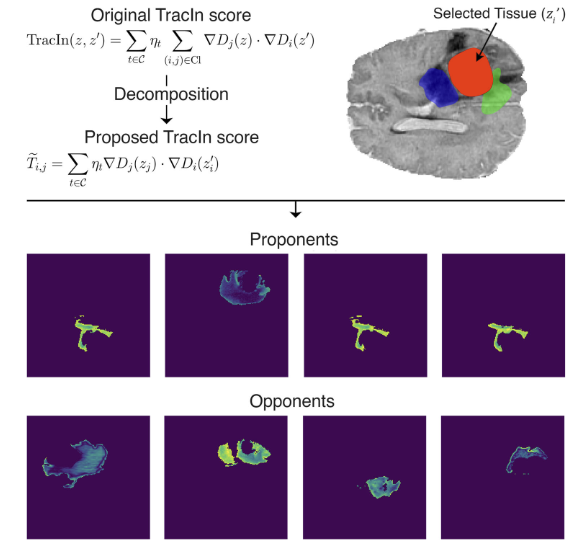
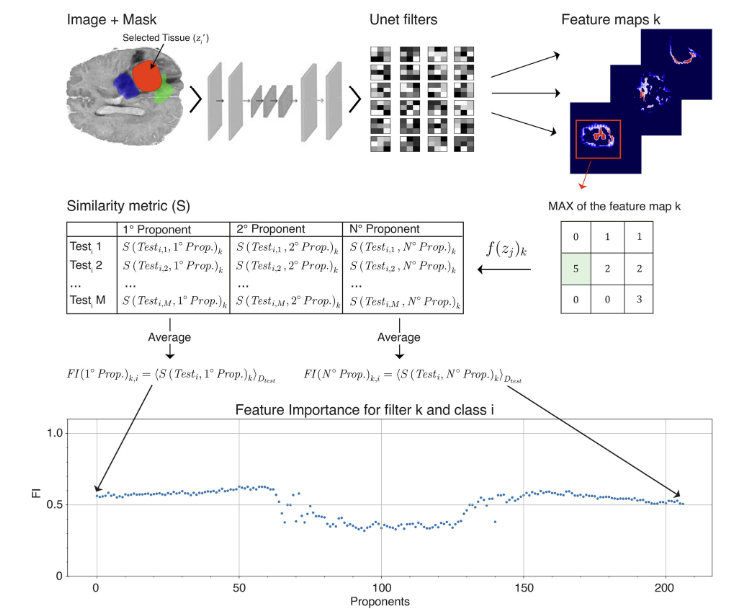
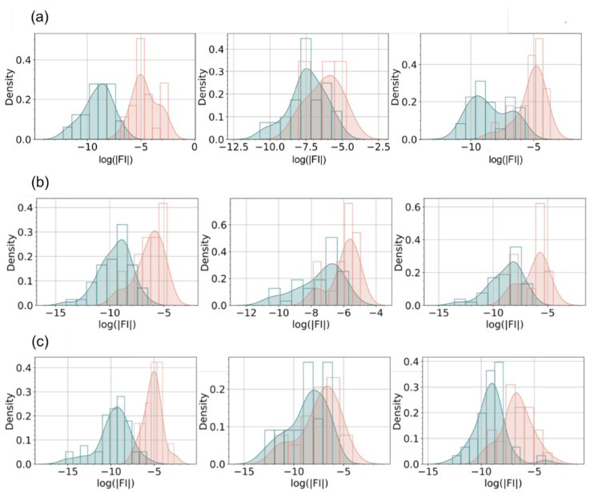

# Influence-Based Explainability for Brain Tumor Segmentation (TracIn-Segmentation)

This repository provides a conceptual overview and the code for the methods described in the paper: "Influence based explainability of brain tumors segmentation in magnetic resonance imaging" published in Progress in Artificial Intelligence.

**Authors:** Tommaso Torda, Andrea Ciardiello, Simona Gargiulo, Greta Grillo, Simone Scardapane, Cecilia Voena, Stefano Giagu.

## Abstract

In recent years Artificial Intelligence has emerged as a fundamental tool in medical applications. Despite this rapid development, deep neural networks remain black boxes that are difficult to explain, and this represents a major limitation for their use in clinical practice. In this paper we focus on the task of segmenting medical images, where most explainability methods proposed so far provide a visual explanation in terms of an input saliency map. The aim of this work is to extend, implement and test an alternative influence-based explainability algorithm (TracIn), proposed originally for classification tasks, to the challenging clinical problem of multiclass segmentation of tumor brains in multimodal magnetic resonance imaging. We verify the faithfulness of the proposed algorithm in linking the similarities of the latent representation of the network to the TracIn output. We further test the capacity of the algorithm to provide local and global explanations, and we suggest that it can be adopted as a tool to select the most relevant features used in the decision process. The method is generalizable for all semantic segmentation tasks where classes are mutually exclusive, which is the standard framework in these cases.

## Key Contributions

1.  **Extension of TracIn to Multiclass Segmentation:** The paper extends the TracIn algorithm, originally designed for classification, to the task of multiclass semantic segmentation in medical imaging. This involves defining influence scores separately for different tissue classes.
2.  **Local Explanations:** Identifies "proponent" (helpful) and "opponent" (harmful) training examples for specific predictions on a test image, providing insights into the model's decision-making process at a local level.
3.  **Global Explanations & Feature Relevance:** Proposes a method to create "interpretative maps" by linking TracIn scores with feature maps from the network's latent space. This helps identify which learned features are most influential for the model's decisions.
4.  **Faithfulness Evaluation:** The faithfulness of the TracIn-based explanations is evaluated by correlating the TracIn scores with the similarity of latent representations and by measuring the impact of identified important features on model performance.
5.  **Application to Brain Tumor Segmentation:** The methodology is applied to the BraTS19 dataset for segmenting gliomas in multimodal MRI, using common architectures like DeepSeg, ResUnet, and Attention UNet.

## Methodology Overview

The core idea is to understand which training samples most influenced a particular segmentation output for a test image.

1.  **Segmentation Models:** Standard 2D CNNs (DeepSeg, ResUNet, Attention UNet) are trained for multiclass brain tumor segmentation (NCR/NET, ED, ET classes) on the BraTS19 dataset.
2.  **TracIn Extension:**
    *   For a test image `z'` and a training image `z`, the influence is calculated not globally, but for specific predicted regions.
    *   If `z'_i` is a region in the test image predicted as class `i`, and `z_j` is a region in a training image predicted as class `j`, TracIn computes `T_i,j`, the influence of `z_j` on the prediction of `z'_i`.
    *   This is based on the dot product of loss gradients with respect to model parameters at various training checkpoints:
        `T_i,j = Σ_t η_t ∇L(θ_t, z'_i) ⋅ ∇L(θ_t, z_j)` (simplified representation).
3.  **Local Explanation:** By sorting `T_i,j` scores, the most influential proponents (high positive `T_i,j`) and opponents (high negative `T_i,j`) from the training set are identified for each segmented region in the test image.

4.  **Interpretative Maps & Global Explanation (Feature Importance):**
    *   Feature maps are extracted from the last hidden layer of the segmentation network for both test and training examples.
    *   A similarity metric `S(z_j, z'_i)_k` is defined between the k-th feature map of a training example region `z_j` and a test example region `z'_i`.
    *   The Feature Importance `FI(z_j)_k,i` for a feature `k` and class `i` (considering training example `z_j`) is calculated by averaging `S(z_j, z'_i)_k` over all test examples `z'`, ordered by their TracIn scores `T_i,j`.
    *   Plotting `FI` against the rank of proponents/opponents reveals features that consistently contribute positively (predictive features) or negatively to the model's decision for specific classes.

5.  **Faithfulness Metric:** The impact of identified important features is quantified by measuring the drop in Dice score when these features are ablated (e.g., by masking corresponding filters in the last hidden layer).

